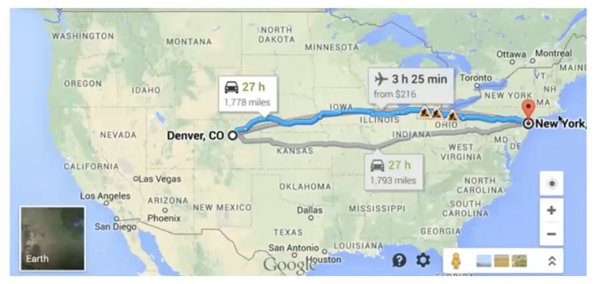
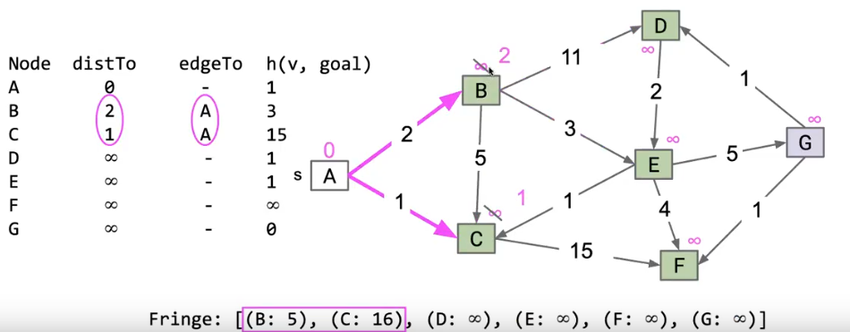

> CS61B中关于图中的路径问题介绍了很多种算法，这些算法之间根据不同的情况做出了相对应的调整，虽然差别不大，但是做个小整理
> 这里针对寻找路径问题，分别整理了DFS,BFS,Dijkstra 算法，A* 算法

# Princeton Graph API
> 这里是 Princeton Algorithm textbook 中给出的图接口，其余方法需要自己添加进行实现

```java
public class Graph{
    public Graph(int V);
    public void addEdge(int v, int w);
    Iterable<Integer> adj(int v);
    int V();
    int E();
}
```
这里要注意几个点：
- 顶点的数量提前由构造函数确定，不可后期更改
- 不支持在结点或者边上设置权重
- 没有针对某个特殊结点得到其边数（度）的方法

## 一位观世音菩萨——`Paths.java`
在一般的图算法设计模式中，我们会将类型进行**解耦**
比如我们会这样做：
- 创造一个图对象
- 将这个图传递到一个图处理方法或者客户类中
- 然后询问这个客户类关于这个图的一些信息

就像有一位贤知的观世音菩萨一样：
```java
public class Paths{
    public Paths(Graph G,int s);
    boolean hasPathTo(int v);
    Iterable<Integer> pathTo(int v);
}
```
**这个Paths类就记录了我们传入的Graph中的所有路径信息**

# 遍历所有路径（不考虑边权重以及结点代价）
## 1.深度优先算法（DFS）
### 两个辅助数组：
- `boolean[] marked`
- `int[] edgeTo`
### 算法流程
dfs(v):
- 标记 v
- 对每一个相邻的结点 w
  - 设置 edgeTo[w] = v
  - dfs(w)

### 算法特征
对于DFS算法有一个特征是：
调用DFS算法的顺序是先序遍历的，而返回DFS算法的顺序是后续遍历的

### 算法实现：
```java
public class DepthFirstPaths{
    private boolean[] marked;
    private int[] edgeTo;
    private int s;
    ...
    public Iterable<Integer> pathTo(int v){
        if(!hasPathTo(v)){
            return null;
        }
        List<Integer> path = new ArrayList<>;
        for(int x = v;x != s; x = edgeTo[x]){
            path.add(x);
        }
        Collection.reverse(path);
        return path;
    }

    public boolean hasPathTo(int v){
        return marked[v];
    }
}
```

## 2.宽度优先算法（BFS）
### 一个辅助队列
初始化一个队列，将一个起点放入队列中，我们把这个队列称作为**fringe**

### 算法流程
一直重复以下操作直到队列为空：
- 将队列第一个结点移出
- 对于该结点的每个未标记的相邻结点n：
  - 标记 n
  - 将 edgeTo[n] 设置为 v（或者distTo[n] = distTo[v] + 1）
  - 将 n 加入该队列

### 算法实现
```java
public class BreadthFirstPaths{
    private void bfs(Graph G,int s){
        Queue<Integer> fringe = new Queue<Integer>();
        fringe.enqueue(s);
        marked[s] = true;
        while(!fringe.isEmpty()){
            int v = fringe.dequeue();
            for(int w: G.adj(v)){
                fringe.enqueue(w);
                marked[w] = true;
                edgeTo[w] = v;
            }
        }
    }
}
```

## 上面这两种算法的缺点
DFS 对于**细长的图**表现得很坏
- 会让函数调用栈变得特别长

BFS 对于**茂盛的图**表现得很坏
- fringe 会变得非常长

并且我们需要 V 的内存来追踪distTo和edgeTo数组

# 考虑权重的遍历
> 如果图中每条路径都有权重，比如谷歌地图中我们想找到距离目的地最近的路线呢


我们会发现只考虑边数是不够的，这样会得出错误的答案，每条边具有对应的长度，也就是权重，这时我们应该采用什么算法呢

## 最短路径树
> 探究这样一个问题：给定一个起点 s 找到对于其他所有顶点的最短路径
> 这样我们画出来的这个路径称作为**最短路径树(SPT)**

## 迪杰斯特拉算法（Dijkstra's Algorithm）
### 三种坏算法
让我们先看三种坏算法，来引入Dijkstra
#### 1.BFS
不考虑权重直接将没有见过的结点加入树中

显然这是一个坏算法，构造出了一个错误的SPT,这是因为我们从A开始，直接把BC都加入了树中，而这条A->B的路径并不是最好的路径，这个只考虑node问题，没有见过的node直接加入

#### 2.虚拟结点
我们把所有路径上的权重看作为一个个虚拟结点：

该算法按照距离起点的远近来将对应的结点加入树，考虑distance的问题，也就是最好优先，这里已经开始触及最核心的部分了
但是我们为什么也不用这个算法呢：

我们不会创造这么多个虚拟结点

#### 3.best first
当fringe不为空时：
- 将最近的结点移出，然后进行标记
- 对于每个出边 v->w : 如果 w 不再 SPT中，那么加入这条边，然后将 w 加入fringe
这个算法有什么问题呢：

我们会发现，他会先把 A->B 加入SPT中，但后续我们考虑 C->B时就会直接跳过他
这个算法中给出的第一个解法太强势了，即使**后面的解法更好，他也不做考虑，像一个顽固的老头**！

### Dijkstra
通过考虑上面三种坏算法，我们发现需要做以下两种修复：
- 根据**距离**来考虑结点
- 对每个边 v->w :如果这条边给出了更好的到 w 的距离，那我们就把这条边加入，**然后在 fringe 中更新 w**

我们会借助一个优先队列PQ，将所有的结点加入PQ，根**据到起点的距离排序**，然后重复：
- 将最近的结点 v 从 PQ 移出，然后 "relax" 从 v 指出的所有边

在这个图中我们的流程是：
1. 所有结点的dist设置为无穷大
2. 从A开始
   1. 走A->C，distTo[C] = 1
   2. 走A->B, distTo[B] = 2
   3. A走完，然后A被标记，即已访问A
3. 考虑BC中最近的
4. 访问C
   1. 走 C->F, distTo[F] = distTo[C] + 15 = 16
   2. C被标记
5. 考虑 BF 中最近的
6. 访问B
   1. 走B->C，发现 distTo[B] + 5 > discTo[C],不是更优路径，不考虑
   2. 走B->E, distTo[E] = distTo[B] + 3 = 5
   3. 走B->D, distTo[D] = distTo[B] + 11 = 13
   4. B被标记
7. 考虑DEF中最近的
8. ....

总结来说就是
- 取出当前PQ中最近的结点，然后将其相邻所有更好的方案结点加入PQ中，然后重复

如果我们发现了更好的方案，我们只需要更新edgeTo数组即可（改变路径），同时更新 distTo 数组来记录更好的距离

### 弊端
如果使用了**负权重**，Dijkstra 算法则会失效
### 伪代码
- PQ.add(source, 0)
- For other vertices, PQ.add(v, infinity)
- While PQ is not empty:
  - p = PQ.removeSmallest()
  - Relax all edges from p
- Relaxing an edge p->q with weight w:
  - If distTo[p] + w < distTo[q]
    - distTo[q] = distTo[p] + w
    - edgeTo[q] = p
    - PQ.changePriority(q, distTo[q])
### 不变量
- edgeTo[v] 是已知的v的最好路径前缀
- distTo[v] 是已知的最好的 v 的路径长度
- PQ按顺序容纳了所有未访问过的结点
### 重要性质
- 总是从起点开始按距离访问结点
- relaxation在每次边指向已经访问过的结点的时候都会失败

看上面这个图就很好理解了

# 不想要进行遍历——启发性算法
上面的算法我们都尝试对所有的结点进行遍历，从而找出最短路径，但是看下面的情况：

我们只想从Denver,CO 到 New York,大致方向上来说我们需要向东行驶，如果我们使用Dijkstra算法，我们同样会遍历所有结点，但是显然向西方行驶是荒谬的！
所以我们采取在每个节点上加上代价的方式，来规避我们不想去的方向，由此我们得到了 A* 算法（A star）

## A* Algorithm
我们看下面这个 A* 算法实例：

在算法的流程上和Dijkstra 算法大致相同，但是在我们进行算法之前，我们会得到一个**代价数组**，记录了每个结点的代价，而与之对应的，我们的Fringe不再以距离作为排序标准，而是用**距离加上当前代价作为标准**
### 注意
Fringe中的代价只是路径加上当前结点的代价，路径中经**过的结点代价不算**，也就是说，A* 算法的 **distTo 数组仍然保持不变**，只是加上了当前结点的代价作为Fringe数组的排序标准

这样通过一个代价数组得到启发，从而有选择性的往某些结点或方向探索的算法，被称为**启发性算法**

